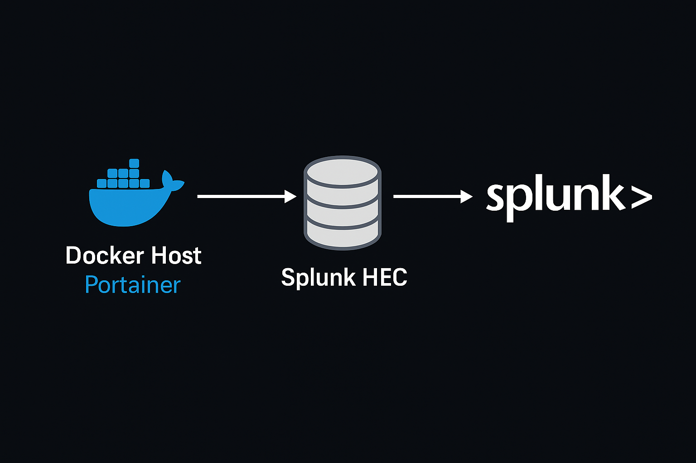

# Ingesting Docker Container Logs into Splunk with Portainer

This walkthrough assumes you already have Splunk up and running and will demonstrate how 
to configure Docker containers to ingest logs into Splunk Enterprise through HTTP Event 
Collector (HEC) over port 8088.



## Prerequisites

- Splunk Enterprise 6.3 or later running in your lab (HEC was introduced in version 6.3)
- Admin access to Splunk Web
- Portainer managing your Docker environment
- Basic Docker knowledge

## Step 1: Enable Splunk HTTP Event Collector (HEC)

1. Log into Splunk Web
2. Navigate: **Settings** → **Data Inputs** → **HTTP Event Collector**
3. Click **Global Settings** → Enable **All Tokens**
4. Create a new token:
   - Name: docker-logs
   - Allowed index: main (or create a dedicated index)
   - **Disable Indexer Acknowledgement** — Docker logging driver does not set channels
5. Copy the generated HEC token

## Step 2: Verify HEC

Run a quick test from the Docker host:

```bash
curl -k https://your-splunk-ip:8088/services/collector/event \
  -H "Authorization: Splunk " \
  -d '{"event": "HEC test event", "sourcetype": "Test", "index": "main"}'
```

Expected response:

```json
{"text":"Success","code":0}
```

Then search in Splunk:

```
index=main sourcetype=Test
```

## Step 3: Configure Container Logging in Portainer

1. In Portainer, open **Containers** → Select your container → **Duplicate/Edit**
2. Go to **Advanced container settings** → **Logging**
3. Configure:

```yaml
Driver: splunk
Options:
  splunk-url: https://your-splunk-ip:8088
  splunk-token: 
  splunk-index: main
  splunk-sourcetype: docker-logs
  splunk-insecure-skip-verify: true (lab only)
  splunk-format: json
  tag: {{.Name}}
```

> **Note:** `splunk-insecure-skip-verify` should only be used in lab environments. 
> In production always use a valid certificate.

4. Redeploy the container

## Step 4: Confirm Logs in Splunk

Generate activity in Gitea, then search:

```
index=main sourcetype=docker-logs
```

## Step 5: Scale with Portainer Stacks

Instead of editing each container, apply logging globally in a Stack:

```yaml
version: "3.8"
services:
  gitea:
    image: gitea/gitea:latest
    logging:
      driver: splunk
      options:
        splunk-url: https://your-splunk-ip:8088
        splunk-token: 
        splunk-index: main
        splunk-sourcetype: docker-logs
        splunk-insecure-skip-verify: "true"
        splunk-format: json
        tag: "{{.Name}}"
```

Deploy via Portainer → **Stacks** → **Add Stack**.

## Troubleshooting

- **"Data channel is missing"** → Double check Indexer Acknowledgement for your HEC token
- **No logs showing** → Verify container logs via docker logs (some apps log to files instead of stdout)
- **Connection errors** → Confirm Splunk listens on TCP 8088 and the firewall allows it, then verify Splunk HEC is started

## Outcome

- OVA and other Docker containers now stream logs directly into Splunk
- Logs are searchable by container name, index, and sourcetype
- Portainer makes scaling log collection across multiple containers straightforward
